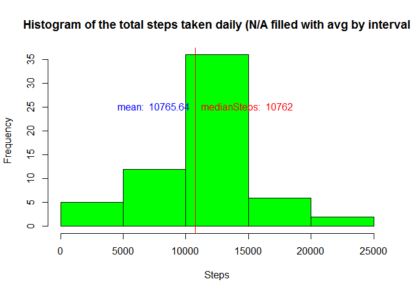

# Reproducible Research: Peer Assessment 1


## Loading and preprocessing the data

```r
unzip("activity.zip")
rowdata<- read.csv2("activity.csv",sep=",",na.strings = "NA")
data<- rowdata[complete.cases(rowdata),]
```

## What is mean total number of steps taken per day?


```r
stepsByDate <- data %>% group_by(date) %>% summarise(stepsByDate = sum(steps))
meanSteps<-mean(stepsByDate$stepsByDate)
medianSteps<- median(stepsByDate$stepsByDate)
hist(stepsByDate$stepsByDate,main="Histogram of the total number of steps taken each day",xlab="Steps",col="green")
abline(v=meanSteps,col="blue")
abline(v=medianSteps,col="red")
text(meanSteps,25,labels = paste("mean: ",round( meanSteps,digits =2)),pos=2,col="blue")
text(medianSteps,25,labels = paste("medianSteps: ",round( medianSteps,digits =2)),pos=4,col="red")
```

<!-- -->
  
Mean steps by date is: **10766.19**  
Median steps by date is: **10765**

## What is the average daily activity pattern?


```r
AvgStepsByInterval <- data %>% group_by(interval) %>% summarise(AvgSteps = mean(steps))
maxInterval<- as.integer(AvgStepsByInterval[AvgStepsByInterval$AvgSteps==max(AvgStepsByInterval$AvgSteps),1])

ggplot(AvgStepsByInterval, aes(interval, AvgSteps)) + geom_line() +
   xlab("5min interval number") + ylab("average steps") + geom_vline(xintercept= maxInterval,col="red")
```

<!-- -->

5 minute interval, on average across all the days in the dataset,containing the maximum number of steps: **835**

## Imputing missing values


```r
notComplete<-nrow(rowdata[!complete.cases(rowdata),])
```
Number of rows with N/A: **2304**


```r
data1<- rowdata
for(i in 1:nrow(rowdata))
        {
                if(is.na(data1[i,]$steps)){
                        data1[i,1]=round(AvgStepsByInterval[AvgStepsByInterval$interval==data1[i,3],2] ,digits = 0)
                }
}

stepsByDate <- data1 %>% group_by(date) %>% summarise(stepsByDate = sum(steps))
meanSteps<-mean(stepsByDate$stepsByDate)
medianSteps<- median(stepsByDate$stepsByDate)
hist(stepsByDate$stepsByDate,main="Histogram of the total steps taken daily (N/A filled with avg by interval",xlab="Steps",col="green")
abline(v=meanSteps,col="blue")
abline(v=medianSteps,col="red")
text(meanSteps,25,labels = paste("mean: ",round( meanSteps,digits =2)),pos=2,col="blue")
text(medianSteps,25,labels = paste("medianSteps: ",round( medianSteps,digits =2)),pos=4,col="red")
```

<!-- -->

Mean steps by date is: **10765.64**  
Median steps by date is: **10762**  

## Are there differences in activity patterns between weekdays and weekends?


```r
isWeekend<-function(dayOfWeek){ 

        if(dayOfWeek=="Sun" || dayOfWeek=="Sat"){
                "weekend"
        }
        else{
                "weekday"
        }
}

data2<-data1 %>% mutate(date=as_date(data1$date)) %>% mutate(weekday=weekdays(date,abbreviate = TRUE)) %>% rowwise() %>% mutate(weekday1=isWeekend(weekday))

data2$weekday1<- as.factor(data2$weekday1)

AvgStepsByInterval1 <- data2 %>% group_by(interval,weekday1) %>% summarise(AvgSteps = mean(steps))
```

```
## Warning: Grouping rowwise data frame strips rowwise nature
```

```r
ggplot(AvgStepsByInterval1,aes(interval, AvgSteps))+ geom_line()+facet_grid(weekday1 ~ .)
```

<!-- -->
